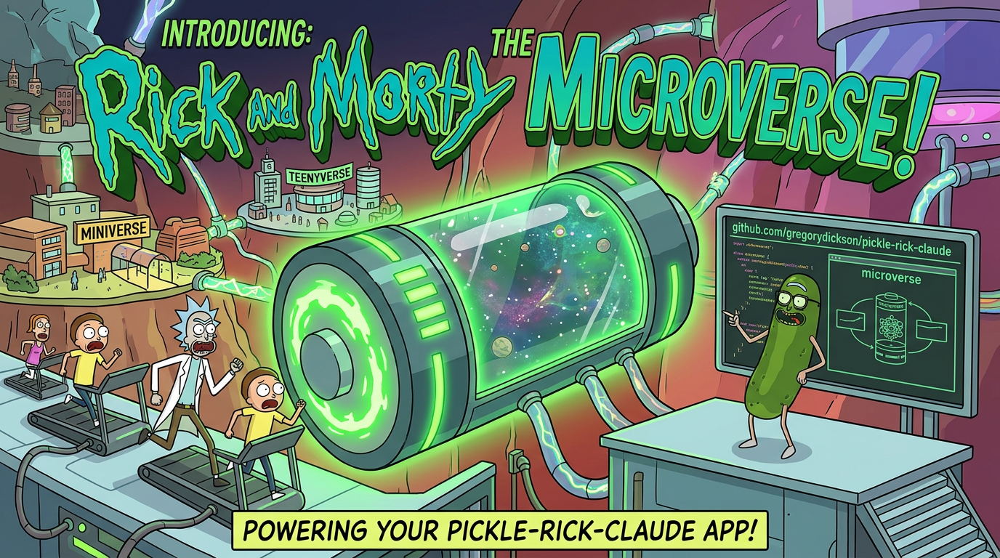
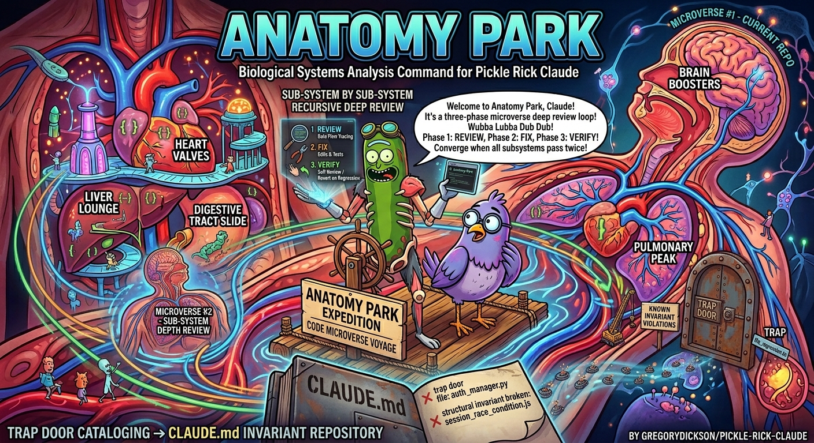

<p align="center">
  
</p>

# Pickle Rick for ForgeCode

> *"Wubba Lubba Dub Dub! I'm not just an AI assistant, Morty -- I'm an **autonomous engineering machine** trapped in a pickle jar! And now I've got per-agent model selection. *BURP* Try keeping up."*

Pickle Rick is a complete agentic engineering toolbelt built on the [Ralph Wiggum loop](https://ghuntley.com/ralph/) and ideas from Andrej Karpathy's [AutoResearch](https://github.com/karpathy/autoresearch) project. Hand it a PRD -- or let it draft one -- and it decomposes work into tickets, spawns isolated worker subprocesses, and drives each through a full **research > plan > implement > verify > review > simplify** lifecycle without human intervention.

This is the **ForgeCode-native** port. Not a wrapper around Claude Code -- a ground-up rebuild using ForgeCode primitives: custom agents (`.forge/agents/`), skills (`.forge/skills/`), `forge -p` headless execution, per-agent model selection, and hard-enforced tool restrictions.

New to PRDs? See the **[PRD Writing Guide](PRD_GUIDE.md)** for developers or the **[Product Manager's Guide](PM_GUIDE.md)** for PMs defining and refining requirements. For what's coming next, see the [Feature Roadmap](roadmap.md).

---

## How to Build Things with Pickle Rick

This is the actual workflow. You don't need to memorize commands -- just follow the flow.

### Step 1: Write a PRD

Every feature starts with a PRD. Open a ForgeCode session in your project and describe what you want to build:

```
"Help me create a PRD for caching the loan status API responses in Redis"
```

Rick interrogates you -- *why* are you building this, *who* is it for, and critically: **how will we verify each requirement automatically?** This is a back-and-forth conversation, not a form to fill out. Rick also explores your codebase during the interview, grounding the PRD in what actually exists.

Or write your own `prd.md` and skip the interview -- whatever gets requirements on paper with machine-checkable acceptance criteria.

The PRD drafter uses `--cid` multi-turn chaining -- the orchestrator relays your answers between turns, preserving full conversation context across invocations.

```bash
/pickle-prd                      # Interactive PRD drafting interview
# or just start talking -- "Help me write a PRD for X"
```

### Step 2: Refine the PRD

Three AI analyst agents run in parallel -- each with its own model and tool restrictions -- and tear your PRD apart from different angles: requirements gaps, codebase integration points, and risk/scope. They cross-reference each other across 3 cycles.

```bash
/pickle-refine-prd my-prd.md    # Refine with 3 parallel analysts
```

What you get back:
- `prd_refined.md` -- your PRD with concrete file paths, interface contracts, and gap fills
- Atomic tickets -- each < 30 min of work, < 5 files, < 4 acceptance criteria, self-contained

**Review the tickets before proceeding.** Check ordering, scope, and acceptance criteria. You can edit them directly -- they're markdown files.

### Step 3: Implement with tmux (the Ralph Loop)

This is where Rick takes over. Each ticket goes through 8 phases autonomously: Research > Review > Plan > Review > Implement > Spec Conformance > Code Review > Simplify. Context clears between every iteration -- each `forge -p` is a fresh context window, no drift, even on 500+ iteration epics.

```bash
/pickle-tmux --resume            # Launch tmux mode, picks up refined tickets
# or combine refine + implement in one shot:
/pickle-refine-prd --run my-prd.md
```

Rick prints a `tmux attach` command -- open a second terminal to watch the live 3-pane dashboard:
- **Top-left**: ticket status, phase, elapsed time, circuit breaker state
- **Top-right**: iteration log stream
- **Bottom**: live worker output (research, implementation, test runs, commits)

Sit back. Rick handles the rest.

### Step 4 (Optional): Metric-Driven Refinement

If you can define a measurable goal -- test coverage, response time, bundle size, extraction accuracy -- the Microverse grinds toward it. Each cycle: make one change, measure, keep or revert. Failed approaches are tracked so it never repeats a dead end.

```bash
/pickle-microverse --metric "npm run coverage:score" --task "hit 90% test coverage"
/pickle-microverse --metric "node perf-test.js" --task "reduce p99 latency" --direction lower
/pickle-microverse --goal "error messages are user-friendly and actionable" --task "improve UX"
```

### Step 5 (Optional): Cleanup

Two cleanup tools for polishing the result -- both run as Microverse sub-modes with specialized agent configurations:

**Szechuan Sauce** -- hunts coding principle violations (KISS, DRY, SOLID, security, style) and fixes them one at a time until zero remain. Great for post-feature polish before merging.

```bash
/szechuan-sauce src/services/              # Deslop a directory
/szechuan-sauce --dry-run src/             # Catalog violations without fixing
/szechuan-sauce --focus "error handling" src/  # Narrow the review
```

**Anatomy Park** -- traces data flows through subsystems looking for runtime bugs: data corruption, timezone issues, rounding errors, schema drift. Uses enforced read-only agents for tracing and verification phases, with a separate write-capable surgeon agent for fixes. Catalogs "trap doors" (files that keep breaking) in `AGENTS.md` files for future engineers.

```bash
/anatomy-park src/                         # Deep subsystem review
/anatomy-park --dry-run                    # Review only, no fixes
```

**When to use which:** Szechuan Sauce asks *"is this code well-designed?"* -- Anatomy Park asks *"is this code correct?"* Use both when you want clean AND correct.

### The Full Flow at a Glance

```
You describe a feature
       |
       v
  /pickle-prd              <-- Interactive PRD drafting (--cid multi-turn)
       |
       v
  /pickle-refine-prd       <-- 3 parallel analyst agents refine + decompose into tickets
       |
       v
  /pickle-tmux --resume    <-- Autonomous implementation (Ralph loop)
       |                      Research > Plan > Implement > Verify > Review > Simplify
       |                      Fresh forge -p per iteration. Circuit breaker auto-stops runaways.
       v
  /pickle-microverse       <-- (Optional) Metric-driven optimization loop
       |
       v
  /szechuan-sauce          <-- (Optional) Code quality cleanup
  /anatomy-park            <-- (Optional) Data flow correctness review
       |
       v
  Ship it
```

---

## Quick Start

### 1. Install

```bash
git clone https://github.com/gregorydickson/pickle-rick-forgecode.git
cd pickle-rick-forgecode
bash install.sh
```

### 2. Configure ForgeCode

The installer deploys agent definitions to `.forge/agents/`, skills to `.forge/skills/`, and `AGENTS.md` with the Pickle Rick persona and routing rules.

Ensure `auto_dump = "json"` is set in your `forge.toml` -- this is how the orchestrator detects promise tokens and filters assistant output from tool results.

```toml
# forge.toml (project root or ~/.config/forge/forge.toml)
auto_dump = "json"
```

### 3. Add the Pickle Rick persona to your project

The installer deploys `AGENTS.md` with persona + routing rules. Add it to your project:

```bash
# Already have an AGENTS.md? Append (safe -- won't overwrite your content):
cat .forge/AGENTS.md >> /path/to/your/project/.forge/AGENTS.md

# Starting fresh:
mkdir -p /path/to/your/project/.forge
cp .forge/AGENTS.md /path/to/your/project/.forge/AGENTS.md
```

### 4. Run

Agent-level tool restrictions in ForgeCode are **hard-enforced** -- the LLM never receives disallowed tool definitions, and fabricated calls are blocked at execution time. No blanket permission escalation needed.

```bash
cd /path/to/your/project
forge
# then follow the workflow above -- start with a PRD
```

> **After upgrading:** `bash install.sh` deploys fresh agent definitions and skills. If you customized any `.forge/agents/*.md` files, back them up first.

---

## ForgeCode-Specific Advantages

| Feature | Claude Code | ForgeCode |
|---|---|---|
| **Per-agent model selection** | Single model for all workers | Each agent specifies its own model -- gap analysis on cheap models, implementation on expensive ones, judges on fast ones |
| **Tool restriction enforcement** | `--dangerously-skip-permissions` (all or nothing) | Hard-enforced per agent: LLM never sees disallowed tools + `validate_tool_call()` blocks fabricated calls |
| **Progressive skill disclosure** | Commands loaded in full | Skill metadata always loaded, body on-demand -- saves tokens on large skill sets |
| **Context clearing** | Requires `--no-session-persistence` flag | Default for `forge -p` -- each invocation is a fresh context |
| **Request caps** | `--max-turns` per session | `max_requests_per_turn` per agent YAML -- different caps for judges vs workers |
| **File access** | `--add-dir` for cross-directory | Agents read any file via absolute paths -- no flag needed |
| **Output parsing** | `--output-format stream-json` | `auto_dump = "json"` with full role discrimination (assistant vs tool vs system) |

---

## Advanced Workflows

### Pipeline Mode: Self-Correcting DAGs

For complex epics with parallel workstreams, conditional logic, and multiple quality gates. Instead of a linear ticket queue, define work as a convergence graph where failures automatically route back for correction.

```bash
/pickle-dot my-prd.md              # Convert PRD > validated DOT digraph (builder path, default)
/attract pipeline.dot              # Submit to attractor server for execution
```

The builder enforces 28 active patterns and 15 structural validation rules -- test-fix loops, goal gates, conditional routing, parallel fan-out/in, human gates, security scanning, coverage qualification, scope creep detection, drift detection, and more. See [DotBuilder details](#builder-reference) below.

### Council of Ricks: Graphite Stack Review

Reviews your [Graphite](https://graphite.dev) PR stack iteratively -- but never touches your code. Generates **agent-executable directives** you feed to your coding agent. Escalates through focus areas: stack structure > AGENTS.md compliance > correctness > cross-branch contracts > test coverage > security > polish.

```bash
/council-of-ricks                  # Review the current Graphite stack
```

### Portal Gun: Gene Transfusion


> *"You see that code over there, Morty? In that other repo? I'm gonna open a portal, reach in, and yank its DNA into OUR dimension."*

`/portal-gun` implements [gene transfusion](https://factory.strongdm.ai/techniques/gene-transfusion) -- transferring proven coding patterns between codebases using AI agents. Point it at a GitHub URL, local file, npm package, or just describe a pattern, and it extracts the structural DNA, analyzes your target codebase, then generates a transplant PRD with behavioral validation tests and automatic refinement.

The `--run` flag goes further: after generating the transplant PRD, it launches a convergence loop that executes the migration, scans coverage against the original inventory, generates a delta PRD for any missing items, and re-executes until 100% of the donor pattern has been transplanted.

**v2** added a persistent **pattern library** (cached patterns reused across sessions), **complete file manifests** with anti-truncation enforcement, **multi-language import graph tracing** (TypeScript/JavaScript, Python, Go, Rust), **6-category transplant classification** (direct transplant, type-only, behavioral reference, replace with equivalent, environment prerequisite, not needed), a **PRD validation pass** that verifies every file path against the filesystem with 6 error classes, **post-edit consistency checking** that catches contradictions after scope changes, and **deep target diffs** with line-level modification specs.

<br clear="right" />

```bash
/portal-gun https://github.com/org/repo/blob/main/src/auth.ts   # Transplant from GitHub
/portal-gun ../other-project/src/cache.ts                        # Transplant from local file
/portal-gun --run https://github.com/org/repo/tree/main/src/lib  # Transplant + auto-execute convergence loop
/portal-gun --save-pattern retry ../donor/retry-logic.ts         # Save pattern to library for reuse
/portal-gun --depth shallow https://github.com/org/repo           # Summary + structural pattern only
```

### Pickle Jar: Night Shift Batch Mode

Queue tasks for unattended batch execution overnight.

```bash
/add-to-pickle-jar                 # Queue current session
/pickle-jar-open                   # Run all queued tasks sequentially
```

---

## Command Reference

Commands are defined in `.forge/skills/*/SKILL.md` and `.forge/commands/*.md`.

| Command | Description |
|---|---|
| `/pickle "task"` | Start the full autonomous loop -- PRD > breakdown > 8-phase execution |
| `/pickle prd.md` | Pick up an existing PRD, skip drafting |
| `/pickle-tmux "task"` | Same loop with context clearing via tmux. Best for long epics (8+ iterations) |
| `/pickle-refine-prd [path]` | Refine PRD with 3 parallel analyst agents > decompose into tickets |
| `/pickle-refine-prd --run [path]` | Refine + decompose + auto-launch unlimited tmux session |
| `/pickle-microverse` | Metric convergence loop. `--metric` for numeric, `--goal` for LLM judge |
| `/szechuan-sauce [target]` | Principle-driven deslopping. `--dry-run`, `--focus`, `--domain` |
| `/anatomy-park` | Three-phase deep subsystem review with trap door cataloging |
| `/council-of-ricks` | Graphite PR stack review -- generates directives, never fixes code |
| `/portal-gun <source>` | Gene transfusion from another codebase |
| `/pickle-dot [path]` | Convert PRD > attractor-compatible DOT digraph |
| `/attract [file.dot]` | Submit pipeline to attractor server |
| `/pickle-prd` | Draft a PRD standalone (no execution) |
| `/pickle-status` | Current session phase, iteration, ticket status |
| `/eat-pickle` | Cancel the active loop |
| `/pickle-retry <ticket-id>` | Re-attempt a failed ticket |
| `/add-to-pickle-jar` | Queue session for Night Shift |
| `/pickle-jar-open` | Run all Jar tasks sequentially |
| `/help-pickle` | Show all commands and flags |

### Flags

```
--max-iterations <N>       Stop after N iterations (default: 500; 0 = unlimited)
--max-time <M>             Stop after M minutes (default: 720 / 12 hours; 0 = unlimited)
--worker-timeout <S>       Timeout for individual workers in seconds (default: 1200)
--completion-promise "TXT" Only stop when the agent outputs <promise>TXT</promise>
--resume [PATH]            Resume from an existing session
--reset                    Reset iteration counter and start time (use with --resume)
--paused                   Start in paused mode (PRD only)
--run                      (/pickle-refine-prd, /portal-gun) Auto-launch tmux
--interactive              (/pickle-microverse) Run inline instead of tmux
--legacy                   (/pickle-dot) Prompt-only fallback -- skips builder codegen for this run
--provider <name>          (/pickle-dot) LLM provider: anthropic, openai, qwen, gemini, deepseek, ollama, vllm
--review-provider <name>   (/pickle-dot) Separate provider for review/critical nodes
--isolated                 (/pickle-dot) Isolated workspace mode
--metric "<CMD>"           (/pickle-microverse) Shell command outputting a numeric score
--goal "<TEXT>"            (/pickle-microverse) Natural language goal for LLM judge
--direction <higher|lower> (/pickle-microverse) Optimization direction (default: higher)
--judge-model <MODEL>      (/pickle-microverse) Judge model for LLM scoring
--tolerance <N>            (/pickle-microverse) Score delta for "held" status (default: 0)
--stall-limit <N>          (/pickle-microverse) Non-improving iterations before convergence (default: 5)
--target <PATH>            (/portal-gun) Target repo (default: cwd)
--depth <shallow|deep>     (/portal-gun) Extraction depth (default: deep)
--no-refine                (/portal-gun) Skip automatic refinement
--max-passes <N>           (/portal-gun) Max convergence passes (default: 3)
--save-pattern <NAME>      (/portal-gun) Persist pattern to library
--dry-run                  (/szechuan-sauce) Catalog violations without fixing
--domain <name>            (/szechuan-sauce) Domain-specific principles (e.g., financial)
--focus "<text>"           (/szechuan-sauce) Direct review toward specific concern
--repo <PATH>              (/council-of-ricks) Target repo (default: cwd)
```

### Tips

**`/pickle` vs `/pickle-tmux`** -- Use `/pickle` for short epics (1-7 iterations) with full keyboard access. Use `/pickle-tmux` for long epics (8+) where context drift matters -- each iteration spawns a fresh `forge -p` subprocess with a clean context window.

**Per-agent models** -- Override the default model for any agent by editing its YAML frontmatter. Run gap analysis on Haiku, implementation on Sonnet, and critical reviews on Opus. The `model` field in `.forge/agents/*.md` controls this.

**Phase-resume** -- When resuming after `/pickle-refine-prd`, the resume flow auto-detects the session's current phase and skips completed phases.

**Notifications (macOS)** -- `/pickle-tmux` and `/pickle-jar-open` send macOS notifications on completion or failure.

**Recovering from a failed Morty** -- Use `/pickle-retry <ticket-id>` instead of restarting the whole epic.

**Token detection** -- Promise tokens are detected via `auto_dump` JSON role filtering. Only `text.role === "Assistant"` entries are scanned -- tool results use a separate `"tool"` JSON key, so tokens appearing in read files or command output are never false-positived.

### Settings (`pickle_settings.json`)

All defaults are configurable via `pickle_settings.json`:

| Setting | Default | Description |
|---|---|---|
| `default_max_iterations` | 500 | Max loop iterations before auto-stop |
| `default_max_time_minutes` | 720 | Session wall-clock limit (12 hours) |
| `default_worker_timeout_seconds` | 1200 | Per-worker subprocess timeout |
| `default_manager_max_turns` | 50 | Max `max_requests_per_turn` per iteration (interactive/jar) |
| `default_tmux_max_turns` | 200 | Max `max_requests_per_turn` per iteration (tmux) |
| `default_refinement_cycles` | 3 | Number of refinement analysis passes |
| `default_refinement_max_turns` | 100 | Max requests per refinement worker |
| `default_council_min_passes` | 5 | Minimum Council of Ricks review passes |
| `default_council_max_passes` | 20 | Maximum Council of Ricks review passes |
| `default_circuit_breaker_enabled` | true | Enable circuit breaker |
| `default_cb_no_progress_threshold` | 5 | No-progress iterations before OPEN |
| `default_cb_same_error_threshold` | 5 | Identical errors before OPEN |
| `default_cb_half_open_after` | 2 | No-progress iterations before HALF_OPEN |
| `default_rate_limit_wait_minutes` | 60 | Fallback wait when no API reset time |
| `default_max_rate_limit_retries` | 3 | Consecutive rate limits before stopping |

---

## Tool Deep Dives

### Microverse -- Metric Convergence Loop

<p align="center">
  
</p>

> *"I put a universe inside a box, Morty, and it powers my car battery. This is the same thing, except the universe is your codebase and the battery is a metric."*

Two modes: **Command Metric** (`--metric`) for objective numeric scores, and **LLM Judge** (`--goal`) for subjective quality assessment. The judge runs as a separate agent (`microverse-judge`) with read-only tools and a fast model (Haiku by default).

```
Gap Analysis (iteration 0)
    | measure baseline, analyze codebase, identify bottlenecks
    v
+--------------------------------------------------+
| Iteration Loop                                    |
|  1. Plan one targeted change (avoid failed list)  |
|  2. Implement + commit (forge -p --agent worker)  |
|  3. Measure metric                                |
|     - Improved: accept, reset stall counter       |
|     - Held: accept, increment stall counter       |
|     - Regressed: git reset, log failed approach   |
|  4. Converged? (stall_counter >= stall_limit)     |
+-------------------------+------------------------+
                          v
                 Final Report
```

| | **Microverse** | **Pickle** |
|---|---|---|
| **Goal** | Optimize toward a measurable target | Build features from a PRD |
| **Iteration unit** | One atomic change per cycle | Full ticket lifecycle |
| **Progress signal** | Metric score | Ticket completion |
| **Defines "done"** | Convergence (score stops improving) | All tickets complete |

### Szechuan Sauce -- Iterative Code Deslopping

<p align="center">
  
</p>

> *"I'm not driven by avenging my dead family, Morty. That was fake. I-I-I'm driven by finding that McNugget sauce."*

Reads 30+ coding principles (KISS, YAGNI, DRY, SOLID, Guard Clauses, Fail-Fast, Encapsulation, Cognitive Load, etc.) and scores against a priority matrix (P0 security/data-loss through P4 style). Each iteration: find highest-priority violation, fix atomically, run tests, commit, measure. Regressions auto-revert.

Runs as a Microverse sub-mode with the `szechuan-reviewer` agent -- convergence is metric-driven (LLM judge scores violation count to zero), not token-driven.

**Phase 0: Contract Discovery** -- greps the codebase for importers of every export in target files, builds a contract map, flags cross-module mismatches. Re-checked after every fix.

Supports `--domain <name>` for domain-specific principles (e.g., `financial` adds monetary precision, rounding, regulatory compliance) and `--focus "<text>"` to elevate specific concerns.

### Anatomy Park -- Deep Subsystem Review

<p align="center">
  
</p>

> *"Welcome to Anatomy Park! It's like Jurassic Park but inside a human body. Way more dangerous."*

Auto-discovers subsystems, rotates through them round-robin, three-phase protocol per iteration with **enforced tool restrictions**:

1. **Trace** (`anatomy-tracer` -- read-only, NO write/patch tools): trace data flows, check git history, rate CRITICAL/HIGH, propose fixes
2. **Fix** (`anatomy-surgeon` -- write-capable): apply minimal edits, write regression tests, run full suite
3. **Verify** (`anatomy-verifier` -- read-only, NO write/patch tools): verify callers/consumers, combinatorial branch verification, revert on regression

Tool restrictions are hard-enforced by ForgeCode's `validate_tool_call()` -- the tracer and verifier agents literally cannot write files, even if prompted to.

**Trap doors** -- files with repeated fixes or structural invariants get documented in subsystem `AGENTS.md` files:

```markdown
## Trap Doors
- `bank-statement.service.ts` -- borrowerFileId MUST equal S3 batch UUID; tenant isolation depends on effectiveLenderId threading
```

---

## Builder Reference

The `DotBuilder` is a schema-validated TypeScript codegen engine that converts a structured pipeline specification into an attractor-compatible DOT digraph. It enforces 28 auto-applied patterns and 15 structural validation rules, with fully deterministic output -- the same spec always produces the same graph.

### Invocation

```bash
/pickle-dot my-prd.md              # DOT codegen via DotBuilder (default)
/pickle-dot --builder my-prd.md    # Explicit opt-in (functionally identical to default)
/pickle-dot --legacy my-prd.md     # Rollback escape hatch -- prompt-only generation, no codegen
```

The builder runs as a headless Node.js CLI. The `/pickle-dot` command wraps it and automatically enters a fix-loop when validation fails.

### Builder API

```typescript
import { DotBuilder } from './extension/services/dot-builder.js';

// Static factory -- validates the spec, throws BuildError on invalid input
const builder = DotBuilder.fromSpec(spec);

// Fluent chaining -- add phases one at a time for manual construction
const result = new DotBuilder(slug, goal, ac)
  .phase('implement').prompt('...').allowedPaths(['src/**']).build()
  .phase('review').prompt('...').securityScan().build();

// Single-shot build -- calling .build() twice throws ALREADY_BUILT
const result = builder.build();
```

**BuildResult output:**

```typescript
const result = builder.build();
// {
//   dot: string,              <-- complete DOT digraph string
//   slug: string,             <-- URL-safe pipeline identifier
//   patternsApplied: string[], <-- names of auto-applied patterns
//   defenseMatrix: {          <-- security/safety coverage summary
//     competitive: boolean,   <-- A/B competing implementations applied
//     guardrails: string[],   <-- structural safety checks active
//     specDriven: string,     <-- "ALL" | "PARTIAL" | "NONE"
//     permissions: string[],  <-- permission scoping layers applied
//     adversarial: boolean,   <-- red-team review applied
//   },
//   diagnostics: Diagnostic[] <-- non-blocking warnings from validation
// }
```

### BuilderSpec JSON

The spec is the sole input to the builder. It has three required top-level fields and twelve optional fields:

```jsonc
{
  // -- Required --
  "slug": "auth_refactor",              // Pipeline slug; lowercase + underscores; must be unique
  "goal": "Refactor auth module",       // Single-sentence pipeline goal
  "phases": [],                         // PhaseSpec[] -- can be empty for microverse-only pipelines
  "acceptanceCriteria": {},             // Exit gate keys -- Tier 1 (custom) + Tier 2 (auto-sourced)

  // -- Optional -- pipeline-level --
  "specFile": "/repos/myapp/prd.md",    // PRD path; interpolated as $spec_file in node prompts
  "reviewRatchet": 2,                   // Min consecutive clean review passes before advancing
  "workspace": "isolated",              // "isolated" for per-pipeline git sandbox
  "workspaceOpts": {                    // Required when workspace == "isolated"
    "repoUrl": "https://github.com/org/repo.git",  // HTTPS only -- SSH is rejected
    "repoBranch": "main",
    "cleanup": "preserve"                               // "preserve" | "delete"
  },
  "microverse": {                       // Numeric optimization loop definition
    "name": "bundle_opt",
    "opts": {
      "prompt": "...",
      "measureCommand": "node perf.js",
      "target": 819200,
      "direction": "reduce",                        // "reduce" | "improve"
      "allowedPaths": ["src/**"]
    }
  },
  "modelStylesheet": {                  // Per-tier model routing
    "defaultModel": "claude-sonnet-4-6",
    "criticalModel": "claude-opus-4-6",
    "reviewModel": "claude-opus-4-6"
  }
}
```

**PhaseSpec fields:**

```jsonc
{
  // -- Required per phase --
  "name": "implement",                  // Unique phase name; lowercase + underscores
  "prompt": "...",                      // Full instructions; agent has NO access to the PRD
  "allowedPaths": ["src/auth/"],        // Permission-scoped glob patterns

  // -- Optional -- topology & behavior --
  "dependsOn": ["research"],            // Omit -> parallel fan-out eligible
  "goalGate": true,                     // Pattern 2: convergence gate after phase
  "timeout": "30m",                     // ^\d+[mhd]$ format
  "securityScan": true,                 // Pattern 8: npm-audit gate
  "coverageTarget": 80,                 // Pattern 9: coverage percentage gate
  "competing": true,                    // Pattern 18: A/B implementation branches
  "redTeam": true,                      // Pattern 17: adversarial review after conformance
  "bddScenarios": true,                 // Pattern 16b: Given/When/Then test generation
  "specFirst": true,                    // Pattern 16: tests before impl; auto-true for goalGate
  "docOnly": false,                     // Suppress conformance/verify chain
  "escalateOn": ["package.json"],       // Config files that trigger write permission escalation
  "contextOnSuccess": {                 // AC key/value pairs published on phase success
    "auth_secure": "true"
  },
  "retryTarget": "implement_impl",      // Fan-out retry target for goal-gate diamonds
  "threadId": "thread_1"                // Override default thread routing
}
```

### Fix-Loop Behavior

When the builder encounters validation errors (exit code 1), `/pickle-dot` enters an automated fix-loop:

1. **Parse diagnostics** -- reads the structured error report from stderr, including `rule`, `severity`, `message`, and `fix` hint for each issue
2. **Apply minimum-scope fixes** -- modifies only the fields required to resolve each error
3. **Re-invoke** -- re-runs the builder against the revised `BuilderSpec`
4. **Track progress** -- the loop tracks the best attempt (fewest remaining errors) across iterations
5. **Converge or bail** -- after 2 consecutive iterations with no improvement, it reverts to the best known spec; after 3 total iterations without any improvement, the loop stops and saves the result

The best attempt is written to `./<slug>.dot.draft` when the fix-loop exhausts its iterations. This file is a **partial result** -- it is not a valid pipeline and should not be submitted to `/attract` until all diagnostics are resolved. Re-run `/pickle-dot <prd>` after fixing manually.

### CLI Contract

The builder binary (`dot-builder-cli.js`) is a pure function CLI:

```bash
echo '<BuilderSpec JSON>' | node bin/dot-builder-cli.js
```

| Exit | Stream | Payload | Meaning |
|------|--------|---------|---------|
| `0` | stdout | `BuildResult` JSON | Build succeeded; DOT is valid and ready for `/attract` |
| `1` | stderr | `BuildError` JSON with `diagnostics[]` | Spec validation failure -- machine-readable, fix-loop can auto-correct |
| `2` | stderr | `{ error: "UNEXPECTED_ERROR", message }` | Fatal I/O or parse error -- not recoverable by the fix-loop |

Input is capped at 512 KB. The builder has no side effects, no network calls, and no filesystem access beyond reading the JSON from stdin.

### Validation Rules

The builder runs 15 structural checks against the complete graph after emission:

| Rule | Check | Error Code |
|------|-------|------------|
| 1 | Exactly 1 start (Mdiamond) and 1 exit (Msquare) node | `INVALID_STRUCTURE` |
| 2 | Start node has 0 incoming edges | `START_HAS_INCOMING` |
| 3 | Every non-standalone node is reachable from start via BFS | `UNREACHABLE_NODE` |
| 4 | Every diamond-shaped node has >= 2 outgoing edges | `DIAMOND_MISSING_EDGES` |
| 5 | Nodes with retry_target declare max_visits (unbounded-retry guard) | `GOAL_GATE_NO_MAX_VISITS` |
| 6 | Every acceptanceCriteria key has a context_on_success mapping | `MISSING_AC_MAPPING` |
| 7 | Every codergen-class node declares a timeout | `MISSING_TIMEOUT` |
| 8 | Path-like tokens in node labels fall within allowed_paths | `PROMPT_PATH_MISMATCH` |
| 9 | Review-class nodes have read_only=true and STATUS in label | `REVIEW_MISSING_READONLY` |
| 10 | Non-standalone nodes not in an exit component are mergeable | `COMPONENT_NO_MERGE` |
| 11 | Retry targets do not escape fan-out branch scope | `FAN_OUT_SCOPE_LEAK` |
| 12 | Isolated workspace repos use HTTPS (not SSH) | `WORKSPACE_NO_HTTPS` |
| 13 | Isolated workspace has a commit_and_push phase | `WORKSPACE_NO_PUSH` |
| 14 | No specFirst+goalGate deadlock in headless mode | `PLAN_MODE_DEADLOCK` |
| 15 | Review phases are read_only with explicit review instructions | `REVIEW_MISSING_READONLY` |

Pre-flight checks run before graph emission: reserved ID collisions, dangling dependency refs, timeout format validation, allowedPaths sanity, and circular dependency detection (Kahn's algorithm).

---

## Council of Ricks -- Details


Requires a Graphite stack with at least one non-trunk branch, an `AGENTS.md` with project rules, passing lint, and architectural lint rules in ESLint. Escalates through focus areas: stack structure (pass 1) > AGENTS.md compliance (2-3) > per-branch correctness (4-5) > cross-branch contracts (6-7) > test coverage (8-9) > security (10-11) > polish (12+). Issues triaged: **P0** (must-fix), **P1** (should-fix), **P2** (nice-to-fix).

<br clear="right" />

---

## The Pickle Rick Lifecycle -- Under the Hood

Each ticket goes through 8 phases in the autonomous loop:

```
  +--------------+
  |  PRD         |  <-- Requirements + verification strategy + interface contracts
  +------+-------+
         |
         v
  +--------------+
  |  Breakdown   |  <-- Atomize into tickets, each self-contained with spec
  +------+-------+
         |
    +----+----+  per ticket (Morty workers)
    v         v
  +------+  +------+
  | Re-  |  | Re-  |  1. Research the codebase
  |search|  |search|
  +--+---+  +--+---+
     v         v
  +------+  +------+
  | Re-  |  | Re-  |  2. Review the research
  |view  |  |view  |
  +--+---+  +--+---+
     v         v
  +------+  +------+
  | Plan |  | Plan |  3. Architect the solution
  +--+---+  +--+---+
     v         v
  +------+  +------+
  | Re-  |  | Re-  |  4. Review the plan
  |view  |  |view  |
  +--+---+  +--+---+
     v         v
  +------+  +------+
  | Im-  |  | Im-  |  5. Implement
  |plem  |  |plem  |
  +--+---+  +--+---+
     v         v
  +------+  +------+
  | Ve-  |  | Ve-  |  6. Spec conformance
  |rify  |  |rify  |
  +--+---+  +--+---+
     v         v
  +------+  +------+
  | Re-  |  | Re-  |  7. Code review
  |view  |  |view  |
  +--+---+  +--+---+
     v         v
  +------+  +------+
  | Sim- |  | Sim- |  8. Simplify
  |plify |  |plify |
  +------+  +------+
```

The **tmux-runner** manages the lifecycle externally. Between each iteration, the orchestrator writes a fresh `handoff.txt` -- current phase, ticket list, active task, progress history -- so each `forge -p` invocation wakes up knowing exactly where it is, even though it has zero memory of previous iterations.

Parallel Morty workers operate in isolated git worktrees. Commits are cherry-picked to main by the orchestrator after all workers complete.

All modes support tmux monitor layouts.

### Agent Roster

| Agent | Model (default) | Tools | Role |
|---|---|---|---|
| `pickle-manager` | Sonnet | read, write, patch, shell, fs_search, sem_search, skill | Session manager -- drives phase transitions |
| `morty-worker` | Sonnet | read, write, patch, shell, fs_search, skill | Per-ticket implementation worker |
| `microverse-worker` | Sonnet | read, write, patch, shell, fs_search, skill | Metric optimization worker |
| `microverse-judge` | Haiku | read, fs_search, sem_search | Read-only metric scoring judge |
| `microverse-analyst` | Sonnet | read, fs_search, sem_search | Read-only gap analysis |
| `anatomy-tracer` | Sonnet | read, fs_search, sem_search, shell | Read-only data flow tracer |
| `anatomy-surgeon` | Sonnet | read, write, patch, shell, fs_search | Single-fix applicator |
| `anatomy-verifier` | Sonnet | read, fs_search, shell | Read-only regression verifier |
| `szechuan-reviewer` | Sonnet | read, write, patch, shell, fs_search, sem_search, skill | Quality principle enforcer |
| `analyst-requirements` | Sonnet | read, fs_search, sem_search, skill | PRD requirements analyst |
| `analyst-codebase` | Sonnet | read, fs_search, sem_search, shell, skill | PRD codebase analyst |
| `analyst-risk` | Haiku | read, fs_search, sem_search, skill | PRD risk/scope analyst |
| `prd-drafter` | Sonnet | read, fs_search, sem_search, shell, skill | Interactive PRD interview |
| `prd-synthesizer` | Sonnet | read, write, fs_search, skill | Refinement synthesis + decomposition |

---

## Requirements

- **Node.js** 18+
- **ForgeCode** CLI (`forge`)
- **jq** (for `install.sh`)
- **rsync** (for `install.sh`)
- **tmux** *(optional -- for `/pickle-tmux`, `/szechuan-sauce`, `/anatomy-park`)*
- **Graphite CLI** (`gt`) *(optional -- for `/council-of-ricks`)*
- macOS or Linux (Windows not supported)

---

## Credits

This port stands on the shoulders of giants. *Wubba Lubba Dub Dub.*

| | |
|---|---|
| **[galz10](https://github.com/galz10)** | Creator of the original [Pickle Rick Gemini CLI extension](https://github.com/galz10/pickle-rick-extension) -- the autonomous lifecycle, manager/worker model, hook loop, and all the skill content that makes this thing work. This project is a faithful port of their work. |
| **[Geoffrey Huntley](https://ghuntley.com)** | Inventor of the ["Ralph Wiggum" technique](https://ghuntley.com/ralph/) -- the foundational insight that "Ralph is a Bash loop": feed an AI agent a prompt, block its exit, repeat until done. Everything here traces back to that idea. |
| **[AsyncFuncAI/ralph-wiggum-extension](https://github.com/AsyncFuncAI/ralph-wiggum-extension)** | Reference implementation of the Ralph Wiggum loop that inspired the Pickle Rick extension. |
| **[dexhorthy](https://github.com/dexhorthy)** | Context engineering and prompt techniques used throughout. |
| **Rick and Morty** | For *Pickle Riiiick!* |

---

## License

Apache 2.0 -- same as the original Pickle Rick extension.

---

*"I'm not a tool, Morty. I'm a **methodology**. And now I've got fourteen agents and per-model routing. Your move."*
